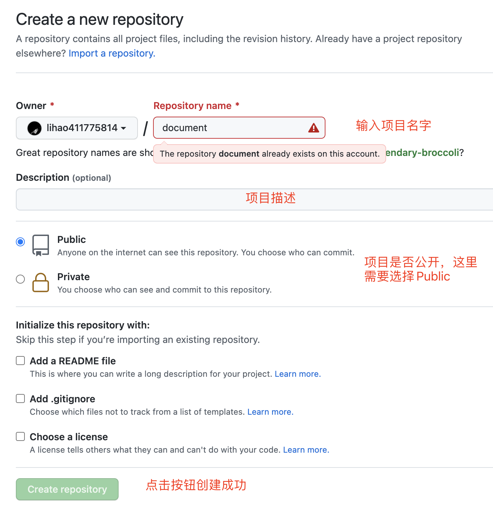

## docsify生成文档

> [docsify](https://docsify.js.org)是一个动态生成文档网站的工具。通过编辑MarkDown文件就能实现简约清爽的文档页面。

1. 先在[Github](https://github.com/)创建项目

   

2. 创建项目成功后，把项目克隆到本地（以自己的实际地址为准，[Git教程](https://www.runoob.com/git/git-tutorial.html)）

   ```bash
   git clone https://github.com/lihao411775814/document.git
   cd document
   ```

3. 安装docsify-cli工具（需要安装[Node.JS](https://www.runoob.com/nodejs/nodejs-install-setup.html)）

   ```bash
   npm i docsify-cli -g
   ```

4. 初始化项目

   ```bash
   docsify init ./docs
   ```

   

5. 运行项目

   ```bash
   docsify serve docs
   ```

   

6. 浏览器访问[http://localhost:3000/](http://localhost:3000/)就能看到首页了

   ```bash
   docsify serve docs
   ```


## Github Pages部署

> 本地搭建成功后，Git上传代码开始准备部署

1. 打开GitHub，进入到项目主页，点击Setting

   

2. 左边选项卡选择“Pages”进行设置

   

右边看到的链接就是你的访问地址了，以后每次更新文档后提交代码即可更新

## 推荐开发工具

1. Visual Studiio Code

   可以编辑HTML方便修改首页或者编辑自定义样式，也支持Markdown。

2. Typora

   Markdown编辑神器，有了Typora，妈妈再也不担心我不会写Markdown了。

